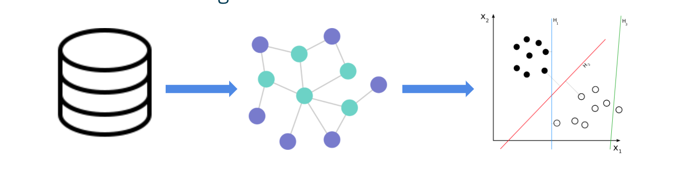

# recordLinkage
DSC 180B Project: Probabilistic Record Linkage

---


The machine learning pipeline can be broken down in 3 steps:
1. graph construction
2. node2vec embedding
3. classifier.

---
To run the program, refer to the config folder for the parameters that can be changed for this program, and use the *python run.py* command to train, test, and evualate the model.Refer to the run.py file for the appropriate command line inputs.

For visualizations and testing can be found in the notebooks directory.

The paper associated with this paper can be found [here](./reports/final_report.pdf)

---
## Example Code

In order to generate the artificial dataset, you can use the command below:
```
python3 gen-data
```

In order to perform the graph construction, use the command:

```
python3 create-small-graphs
```

Lastly, in order to test any changes to the pipeline on example test, use the command:
```
python3 test-project
```

---
## Configuration

(add information about the configurations)