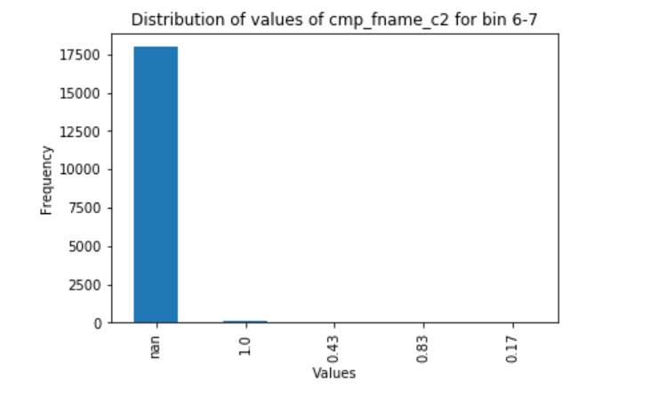
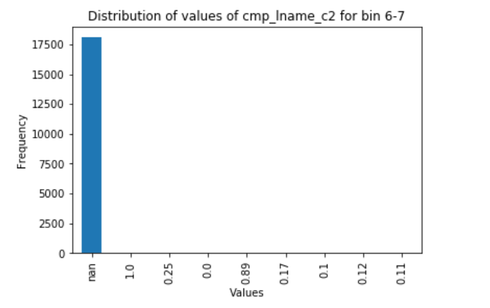

- For Checkpoint 1:
	- Udai: Create code for generating datasets with strong keys (and varying noise)
	- Shinu: Clean and perform EDA on our real-world datasets
	- Wesley: Finalize Structure of our Heterogenous Graphs
		- determine method for representing graphs (on disk)
		- determine method for using quantitative attributes.

### Dataset Generation

### Exploratory Data Analysis

The exploratory data analysis that we will be doing is focused on a real world dataset donated by Epidemiologisches Krebsregister NRW. The dataset contains 5,749,132 records where each row represents two rows in a sample dataset of 100,000 records that have been compared for matches using nine similarity measures.

The nine similarity measures and their respective columns in our dataset are:

1. cmp_fname_c1: agreement of first name, first component
2. cmp_fname_c2: agreement of first name, second component
3. cmp_lname_c1: agreement of family name, first component
4. cmp_lname_c2: agreement of family name, second component
5. cmp_sex: agreement of sex of individual
6. cmp_bd: agreement of date of birth, day component
7. cmp_bm: agreement of date of birth, month component
8. cmp_by: agreement of date of birth, year component
9. cmp_plz: agreement of postal code

The datasets also provides true or false labels that tell us if the two records are a match or not. This is fairly reliable as this was determined during an extensive manual review of the dataset where several documentarists were involved. Hence, we have a ground truth value that we can use to check our models accuracy to solve the problem of record linkage.

One of the first surveys done on the dataset was to find the number of missing attributes in each column.

The above table shows that two columns, cmp_fname_c2 and cmp_lname_c2, have a large number of missing attribute. Missing attributes mean that it will be impossible to check the similarity of the attribute for that particular record against other records and this could result in increasing the difficulty of finding matches.

In order to see this effect, we took a look at the distribution of the missing attributes in the correctly matched records and records that are not a match.

The two tables show that the distribution of missing values in each column, whether they are matched or not, are pretty similar. This means that the missingness is almost equally balanced for records that are matched and those that are not matched. This shows that there is no bias in the way the missing attributes are spread out between matched and not matched records.

Next, we decided to check the overall sum of similarity per record. In order to do this, we converted the missing values to 0. This is because it would be hard to estimate a value as we have no way of knowing the original value.
We summed the columns by row and binned the values into bins of 0-1, 1-2, 2-3, 3-4, 4-5, 5-6, 7-8, 8-9. We proceeded to plot the distribution of these bins for matched and not matched columns.

The plots show us that records that are matched together tend to have a high sum of similarity. There are a 56 outliers from the unmatched records that manage to reach the 6-7 range bin and 13 matched records that fall into the 3-4 bin, however this number is very miniscule. Hence, it should be fairly easy to differentiate between a matched record and an unmatched record.

An exploration of the attributes of the matched records that fall into the 6-7 bin shows that cmp_fname_c2 and cmp_lname_c2 play a large role in the drop of its similarity score.

The rows that fall in the 6-7 bin have a large number of missing values in the cmp_fname_c2 and cmp_lname_c2. If these two columns were not missing, the records could have had much higher similarity measures. Hence, this proves that missing attributes play a large role in determining if two records are a match or not.

The exploration of the missing and similarity values show us that there are correlations between high sum of similarity between attributes and if they are matches, and high number of missing values and low similarity values. Hence, it should be possible to predict if two records are matches or not in this dataset by creating a model that takes these correlations into account.

### Graph Storage and Quantitative Variables in Heterogenous Information Networks

### Works Cited:

1.
