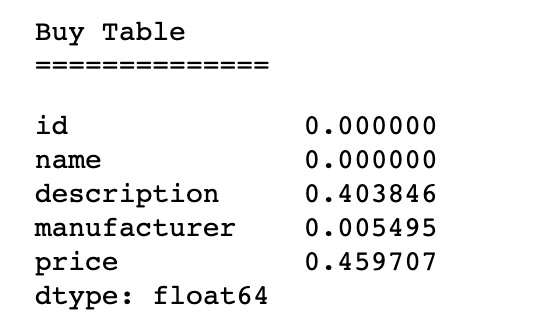

- For Checkpoint 2:
	- All members - performed EDA
	- Udai: Performed EDA on smaller datasets & transformed in graphs.
	- Shinu: Cleaned and performed EDA on datasets
	- Wesley: Created Baselines for future model testing

\pagebreak

# Problem Statement

...**Wesley**

# Datasets

For this project, we are going to be using a large dataset from [Kaggle](https://www.kaggle.com/c/kdd-cup-2013-author-disambiguation/rules) and four smaller datasets from [Leipzig Universities Database Department](https://dbs.uni-leipzig.de/research/projects/object_matching/benchmark_datasets_for_entity_resolution). The goal is to analyze the smaller datasets from Leipzig university in order to verify the validity of our implementation, as well as resolve the glaring issues that may arise within the model.

# Author Disambiguation Dataset

...**Shinu**

# Smaller Datasets

## Introduction

...**Shinu** (describe the source of the smaller datasets)

## Abt-Buy

This dataset is two seperate datasets of with 1081 and 1092 instances of purchasable items with names and description, but without a clear link between the two datasets. Must of the data within this dataset is textual, apart from a price column. However, the price column is the most dirty column in that it has NaN values. There is also an issue with the fact that the description column within the Buy dataset seems to also have many missing values. This intuitively gives means that the meaningful connections must be made between the description and the name columns.

| About Table NaN's      | Buy Table NaN's          |
| ------------- |:-------------:|
| { width=30% }     | { width=30% }|

There is also some abiguity within the dataset. For example, there is a few examples within the dataset in which multiple entities are matched. Within this case, we want our recording linkage algorithm to be able to find that the entities are similar enough rather than being confused by the small differences. In other words, we want our record linkage algorithm to be invariant to such noise within the data.

...**Wesley**

## DBLP-ACM

...**Wesley**

## DBLP-Scholars

...**Wesley**

## Amazon-Google Products

...**Wesley**

## Graph Descriptions

{ width=50% }

After creating the heterogenous graphs, we looked into describing the properties of the graph's nodes. We looked into finding descriptive statistics on each of the datasets seperately, as well as a unified analysis between the four datasets. The four datasets are considerably smaller than the large dataset we will work with. However, they are also very similar to the large dataset we will be using in that they are very heavy on textual data. This will allow us to test our model on a scaled down version of the problem, which will allow us to iterate quickly before testing on the larger dataset, which we anticipate to be computationally much more expensive.

\pagebreak

### Abt-Buy Dataset

|Graph Degree Frequency|Graph Edge Frequency  |
| :-------------: |:-------------:|
| { width=50% }     | { width=50% }|

Within this dataset, we found that this seems to be relating electronic products with based on a name and description. This can be seem above, which shows that there is a high cardinality within the name and description embeddings. Also, as you can see below, there seems to be some overlap within the words for the columns. We can use this heuristic when refining our graphs to match overlapping words. For example, if the word 'black' occurs within the name of 1 entity, as well as the description of the a 2nd entity, we want our model to detect this link. In a probabilistic sense, this related term within the two entities should be detected as improving the chances of a matching entity. Lastly, it seems that this dataset will primary test the ability of the model to detect common words between columns using the graph embedding.

|Most common words in Description|Most Common Words in Manufacturer  |
| :-------------: |:-------------:|
| { width=13% }    | { width=20% }|

### DBLP-ACM & DBLP-Scholars

|DBLP-ACM Graph Degree Frequency|DBLP-ACM Graph Edge Frequency  |DBLP-Scholars Graph Edge Frequency|DBLP-Scholars Graph Degree Frequency |
| :-------------: |:-------------:|:-------------: |:-------------:|
| { width=100% }     | { width=100% }| { width=100% }| { width=100% }|

These are two related datasets with the task of relating an author with a paper. The primary difference within the two datasets is the importance placed on the decription compared to the other node types. As you can see from above, the DBLP-Scholars dataset has relatively more information stored within the venue and year columns compared to the DBLP-ACM dataset. These datasets are, in terms of content and statistics, the related to the large dataset we will work with. This means that this will likely act as the primary dataset we will like to test on before scaling up to the large datast.

### Amazon-Google Products

|Graph Degree Frequency|Graph Edge Frequency  |
| :-------------: |:-------------:|
| { width=50% }     | { width=50% }|

This dataset is based on relating the product descriptions between the product descriptions within Google and Amazon. This looks similar to the Abt-Buy dataset, in that they are both heavily on textual data and are looking at a related topic of technology. As you can see below, our textual embedding has found nodes with common electronic terms. Also, this seems to have limited stop words, which means that our embedding looks to be meaningful in service of the task of characterizing an item within the dataset.

{ width=50% }

\pagebreak

### Revision to the Proposal

...**Shinu**

### Backlog:

- For Checkpoint 1:
	- All members - revised proposal
	- Udai: Create code for generating datasets with strong keys (and varying noise)
	- Shinu: Clean and perform EDA on our real-world datasets
	- Wesley: Finalize Structure of our Heterogenous Graphs
		- determine method for representing graphs (on disk)
		- determine method for using quantitative attributes.

- For Checkpoint 2:
	- Generate Heterogenous Graphs (Udai)
	- Train baselines Models (Wesley)
		- perform tests over a subset of generated datasets
	- Clean real dataset and transform in a usable format (Shinu)
	- Stretch Goal: Train/Evaluate Hindroid Model using our data (everyone)

...**Shinu**
- For checkpoint 3:
	- (add schedule here)
