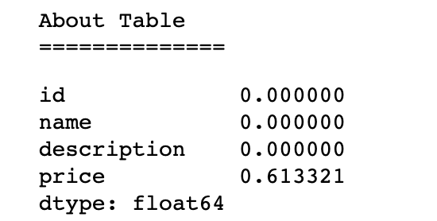

- For Checkpoint 2:
	- All members - performed EDA
	- Udai: Performed EDA on smaller datasets & transformed in graphs.
	- Shinu: Cleaned and performed EDA on datasets
	- Wesley: Created Baselines for future model testing

\pagebreak

# Problem Statement

...**Wesley**

# Datasets

...**Udai**
(describe how we're going to be using the small & big datasets)

# Author Disambiguation Dataset

...**Shinu**

# Smaller Datasets

## Introduction

...**Shinu** (describe the source of the smaller datasets)

## Abt-Buy

This dataset is two seperate datasets of with 1081 and 1092 instances of purchasable items with names and description, but without a clear link between the two datasets. Must of the data within this dataset is textual, apart from a price column. However, the price column is the most dirty column in that it has NaN values. There is also an issue with the fact that the description column within the Buy dataset seems to also have many missing values. This intuitively gives means that the meaningful connections must be made between the description and the name columns.

| About Table NaN's      | Buy Table NaN's          |
| ------------- |:-------------:|
| { width=30% }     | { width=30% }|

There is also some abiguity within the dataset. For example, there is a few examples within the dataset in which multiple entities are matched. Within this case, we want our recording linkage algorithm to be able to find that the entities are similar enough rather than being confused by the small differences. In other words, we want our record linkage algorithm to be invariant to such noise within the data.

...**Wesley**

## DBLP-ACM

...**Wesley**

## DBLP-Scholars

...**Wesley**

## Amazon-Google Products

...**Wesley**

## Graph Descriptions

...**Udai**

\pagebreak

### Revision to the Proposal

...**Shinu**

### Backlog:

- For Checkpoint 1:
	- All members - revised proposal
	- Udai: Create code for generating datasets with strong keys (and varying noise)
	- Shinu: Clean and perform EDA on our real-world datasets
	- Wesley: Finalize Structure of our Heterogenous Graphs
		- determine method for representing graphs (on disk)
		- determine method for using quantitative attributes.

- For Checkpoint 2:
	- Generate Heterogenous Graphs (Udai)
	- Train baselines Models (Wesley)
		- perform tests over a subset of generated datasets
	- Clean real dataset and transform in a usable format (Shinu)
	- Stretch Goal: Train/Evaluate Hindroid Model using our data (everyone)

...**Shinu**
- For checkpoint 3:
	- (add schedule here)
